# Le Nuvole
Le nuvole is a product of two people falling in love, which with along their passion for music, different heritage and background gives birth to their unique sound. 

The purpose of this website is to expand their brand awareness, increase online presence and monetize their project. 
## UX
Due to their style of music and their repertoire, this website is meant to attract a mid-twenties to upwards demographic with a love for fine music, interested in either a night out or in booking a band for their bar, party or wedding

### User stories
* As a first time user, I want to discover their music, so i can potentially become a new follower
* As a first time user, I want to check for an upcoming jazz gig in the brisbane area, so I can potentially buy a ticket and go see the band
* As a first time user, I want to check for the band's social pages, so I can potentially follow the band
* As a returning user, I want to listen to their latest song or performance, so I can renew my interest for the band
* As a returning user, I want to check for their next gig date, so I know when and where to go see the band
* As a potential client, I would like to enquire about their music, story, location, availability and stage appearance, to decide if to book the band for my venue or party
* As a returning client, I would like to enquire about their availability, so I can book the band
* As a couple, we would like to enquire about their music, story, personality, location, availability and stage appearance, to decide if to book the band for our wedding

[Link to Wireframe](/workspace/gitpod-full-template/assets/wireframes/le-nuvole-wireframe.pdf)

## Features
### Existing features
* Biography - Allows first time users or clients to learn more about the band's story, music and personality, by having them read it in the home page
* Latest performance video - Allows first time or returning users to see the most recent and relevant performance by watching the video in the home page directly beside the bio
* Social media links  (Large) - Being a website's band, social links are very important to keep in touch with the latest developments, therefore they are placed, in bold, directly below the bio, in the middle of the page for visibility
* Upcoming dates schedule - Allows first time or returning users to keep up to date with the band's upcoming gigs by looking at the schedule table
* 'Buy tickets' button - Allows first time or returning users to buy a ticket to a band's performance, by clicking on the button
* Social media links (Footer) - Allows first time or returning users to link to the band's social media platforms, regardless of the page they are in, by clicking on the icons
* Media page - Allows first time or returning users to see or listen to the band's past performances or repertoire, by clicking on the embedded video clips or audio files through the HTML audio player
* Gallery page - Allows first time users or clients to see the band's presence and image by looking at their pictures
* 'Book us' button and modal - Allows first time or returning clients to book or enquire with the band about an event, by clicking the button and filling out the form

## Technologies used
* HTML
    * The project uses HTML5 as it is the latest and upgraded version of HTML and it is part of the languages I so far covered throughout the course
* CSS
    * The project uses CSS3 as it is an easy, consistent, lightweight and fast language to style the HTML 
* [Bootstrap](https://getbootstrap.com/)
    * The project uses Bootstrap as it is beneficial to build a responsive website
* Javascript
    * The project uses Javascript to collapse the navbar in smaller viewports, and to create a pop up modal
* [FontAwesome](https://fontawesome.com/)
    * The project uses FontAwesome to take advantage of icons
* [Google Font](https://fonts.google.com/)
    * The project uses Google fonts to take advantage of extensive fonts libraries, in particular the exact fonts used in the band's logo
* [Hover.css](https://cdnjs.com/libraries/hover.css)
    * The project uses Hover.css, a collection of CSS3 powered hover effects

## Testing
### HTML validator
* The validator displayed the "section lacks heading" warning in the "Home" and "Media" page. 
Added an h2 in both. 
* All 3 HTML pages have successfully passed the validator
### CSS validator
* CSS diplayed the "-webkit-background-size, -moz-background-size and -0-background-size is an unknown vendor extension" warning on my "hero-image", I have removed the properties
* CSS has successfully passed the validator
### Manual testing
| User story | User journey |
| ---------- | ------------ |
| As a first time user, I want to discover their music | In the home page I click on the [latest performance video](#latest-performance-video-and-bio) |
| As a first time user, I want to discover their music | I click on the [media page](#media-page) link and play either the [embedded videos](#embedded-videos) or play the [audio player](#audio-player) |
| As a first time user, I want to check for an upcoming jazz gig in the brisbane area | In the Home page I scroll down to the [upcoming dates table](#upcoming-dates-table-and-tickets) and click on the [tickets button](#upcoming-dates-table-and-tickets) button if I want |
| As a first time user, I want to check for the band's social pages | In the Home page I scroll down to the [social links section](#social-links-section) and click on the desired platform icon, in other pages I can find social links in the footer section
| As a returning user, I want to listen to their latest song or performance | In the home page I click on the [latest performance video](#latest-performance-video-and-bio) |
| As a returning user, I want to check for their next gig date | In the Home page I scroll down to the [upcoming dates table](#upcoming-dates-table-and-tickets) |
| As a potential client, I would like to enquire about their music and story | In the home page I can read the band's [bio](#latest-performance-video-and-bio) and directly beside it, play the [latest performance video](#latest-performance-video-and-bio) |
| As a potential client, I would like to enquire about their location and availability | In the home page I can read the band's location in the [bio](#latest-performance-video-and-bio) and in the navigation bar [book us](#book-us-and-modal) button modal, I can enquire about availability through the [modal](#book-us-and-modal) form or by [email, call or text](#email-call-text)|
| As a potential client, I would like to enquire about the band's physical and stage appearance | I click on the [gallery page](#gallery-page) link and see a selection of the band's pic, I can also click on them for full scale resolution |
| As a returning client, I would like to enquire about their availability | I can enquire about availability through the [modal](#book-us-and-modal) form by clicking the [book us](#book-us-and-modal) button or link available in all screen sizes |

1. Navigation bar
    1. When I click on the navigation bar title I am redirected to the home page
    2. When I click on the "home" navigation bar link I am redirected to the home page
    3. When I click on the "media" navigation bar link I am redirected to the media page
    4. When I click on the "gallery" navigation bar link I am redirected to the gallery page
    5. When I click on the "book us" navigation bar button I am redirected to the pop up modal
2. Home page image
    1. When I refresh the home page the key frames on the image works as desired
3. Home page video
    1. When I click on the embedded video the video starts playing, does not play in Safari
4. Home page social media section
    1. When I hover over the social links the pop effect works as desired
    2. When I click on any of the social media icons I am redirected to their respective platform's website (Please note that, aside from the facebook icon, all other icons redirect you to the platform main page, rather than the band's page, as the band not yet have a page on the other platforms)
5. Home page table
    1. When I click on the "tickets" button I am redirected to the band's Facebook events page as desired
6. Footer
    1. When I hover over the social links the effect works as desired
    2. When I click on any of the social media icons I am redirected to their respective platform's website (Please note that, aside from the facebook icon, all other icons redirect you to the platform main page, rather than the band's page, as the band not yet have a page on the other platforms )
7. Media page videos
    1. When I click on the embedded videos the videos start playing, does not play in Safari
8. Media page audio
    1. When I click on the HTML audio player the audio starts playing does not play in Safari
9. Gallery photos
    1. When I click on one of the photos I am redirected to another window with the full sized photo as desired
10. Book us buttons or link and Modal
    1. When I try and submit an empty form or with one of the three required fields missing, an error message asking to fill the required fields appears
    2. When I try to submit the form with all fields filled the form sends successfully
    3. When I click on the email link I am successfully redirected to choosing the desired email app
    4. When I click on the phone number link I am successfully redirected to choosing the desired call app
### Testing screenshots:
#### Main page
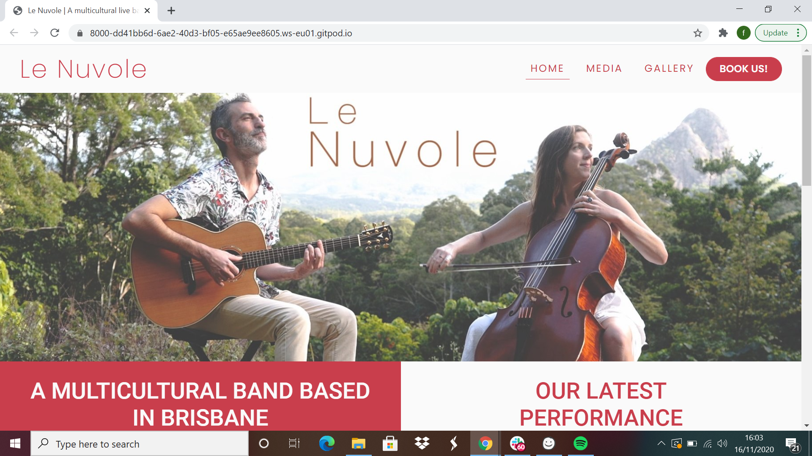
#### <h4 id="latest-performance-video-and-bio">Latest performance video and bio</h4>
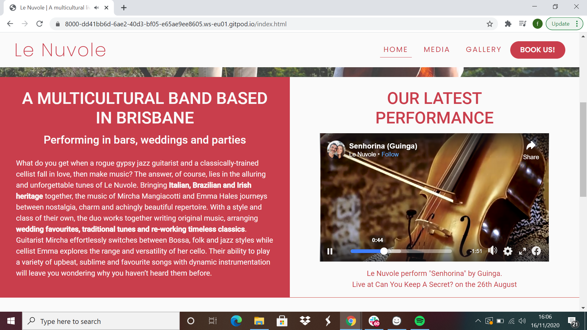
#### <h4 id="media-page">Media page</h4>
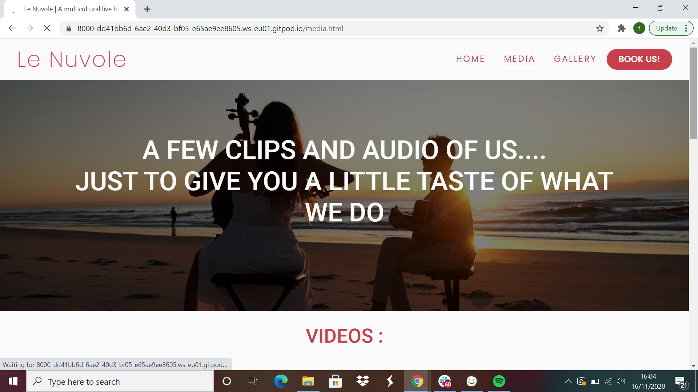
#### <h4 id="embedded-videos">Embedded videos in media page</h4>
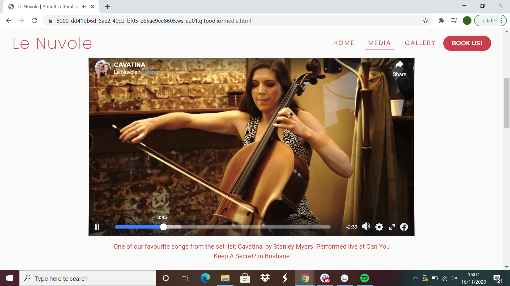
#### <h4 id="audio-player">Audio player</h4>
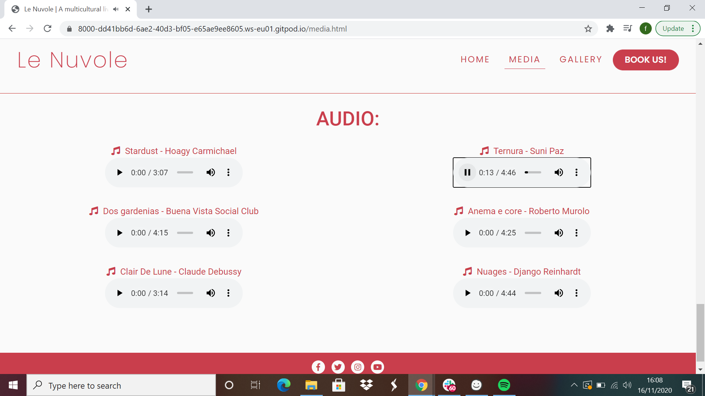
#### <h4 id="gallery-page">Gallery page</h4>

#### <h4 id="book-us-and-modal">Book us button and modal</h4>
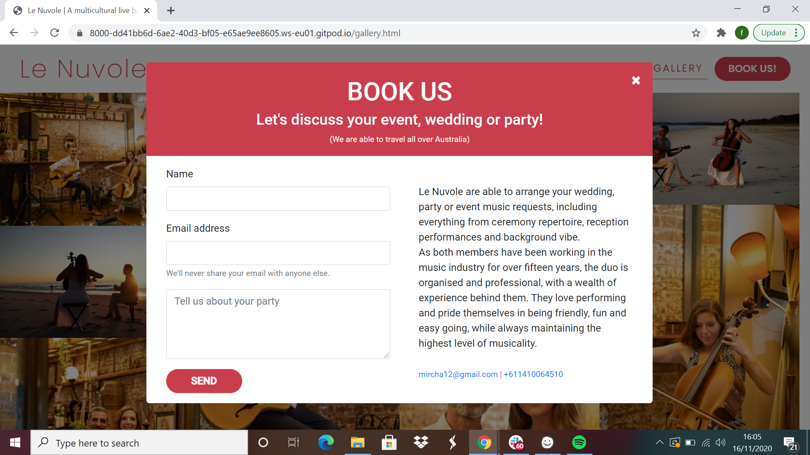
#### Modal required fields
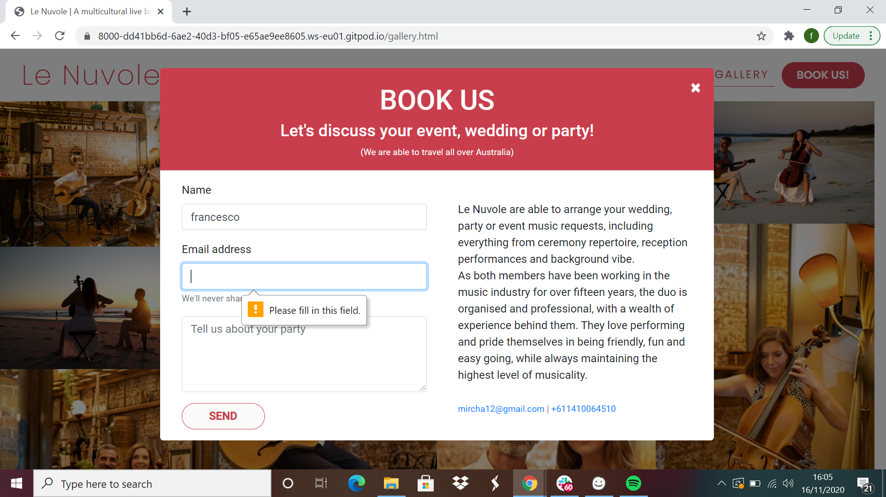
#### <h4 id="email-call-text">Email and tel links</h4>
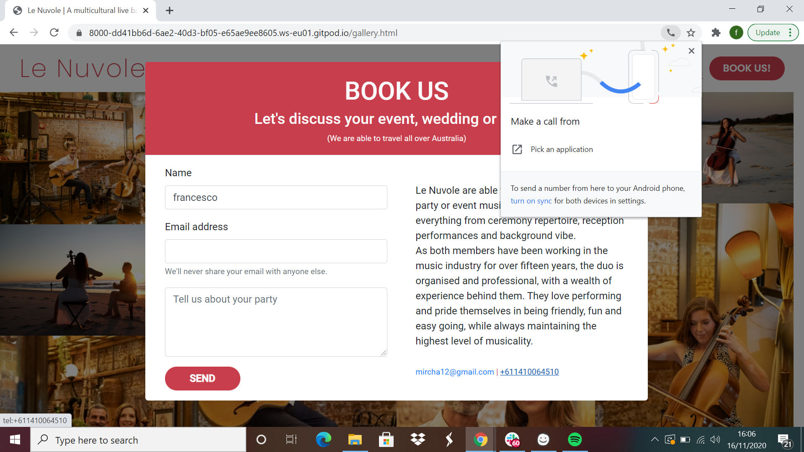
#### <h4 id="upcoming-dates-table-and-tickets">Upcoming dates table and tickets button</h4>
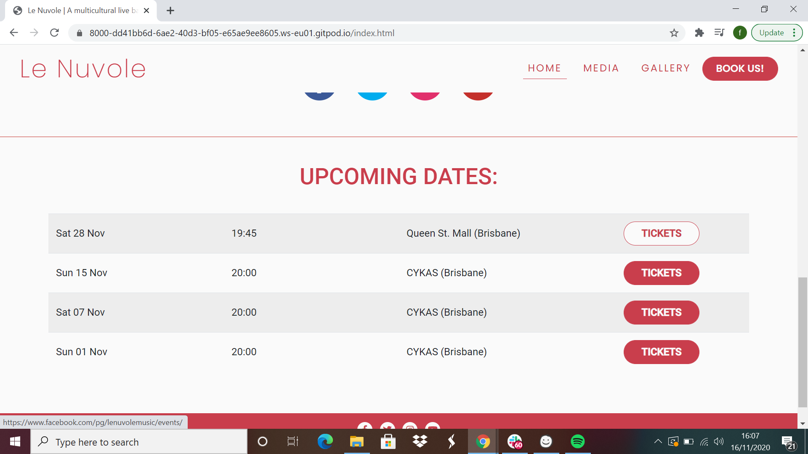
#### Tickets button directory
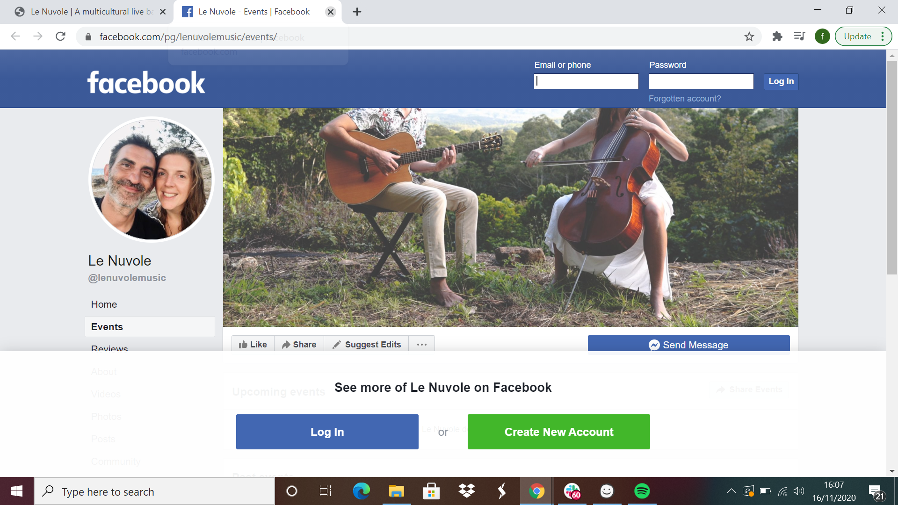
#### Social links directory
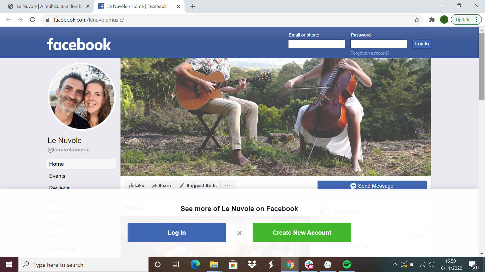

### Browsers
1. The audio player looks different on each browser as each one has a different preset layout
2. Safari does not play the embedded video, Facebook video embeds in Safari by accepting cookies and website data tracking while browsing your site. They can enable this via the Privacy tab within the Preferences menu of Safari, or by accepting the pop-up prompt that appears
3. HTML5 audio player doesn't work on safari, I do not yet know or have the required knowledge to fix this bug

### Screen sizes
1. The website is responsive through bootstrap and media queries, starting from a screen size from as small as 280px to larger than than 1670px
2. All features are visible on every screen size
3. The "book us" button moves from the navbar to the hero image at the sm breakpoint, an additional "book us" link is added in the navbar toggler menu at the sm breakpoint
4. At a 280px size the responsive table scrolls horizontally due to the small size of the screen

## Deployment

## Credits
### Content
* The text for the biography was provided by the band through a word file
* The text for the pop up modal was provided by the band through a word file
* The text for the videos subtitles was obtained from the band's [Facebook page](https://www.facebook.com/lenuvolemusic/)

### Media
* The photos used in the website were provided by the band through jpeg files
* The audio tracks used in the website were provided by the band through wav audio files
* The videos used in the websites were embedded from the band's [Facebook page](https://www.facebook.com/lenuvolemusic/)

### Acknowledgment
* I received inspiration for this project from my brother Mircha and his partner Emma, and their deep bond and passion which was the catalyst to forming their band